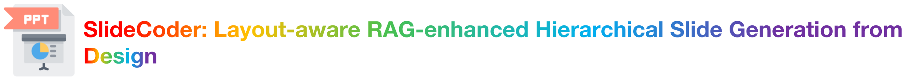

## 1. SlideMaster 🎓

The training code is adapted from [llama-factory](https://github.com/hiyouga/LLaMA-Factory).

To start model training, execute the following script:

```bash
cd SlideMaster
bash train.sh
```

Since LoRA is used for training, a merge stage is required at the end of training:

```bash
bash merge.sh
```

Then, use vllm to start an OpenAI-Compatible Server:

```bash
cd ..
cd SlideCoder
vllm serve ../SlideMaster/output/ppt2code_512_w_intro
```

## 2. Slide2Code 🖼️

We provide an example in `Slide2Code/input`, where the folder structure is as follows:
- `Slide2Code/input/background`: Contains the **Backgrounds** of the slides.
- `Slide2Code/input/images`: Contains the **Pictures** in the ppt.
- `Slide2Code/input/design`: Contains the **Design** images.
- `Slide2Code/input/origin`: Contains the **Reference Image**.

`Slide2Code/Slide2Code.csv` serves as our benchmark. Considering copyright issues, we provide the download URL of each slide's pptx file and the corresponding page number.

## 3. SlideCoder 🛠️

To successfully run the example, you need to execute the following script to run the SlideCoder framework:

```bash
cd SlideCoder
bash scripts/main.sh
```

After running the above code, you will obtain the final code, which needs to be processed through a program. Copy the file `run_all_code.py` to the generated folder directory, and then run it to get the final ppt file:

```bash
cp run_all_code.py $output_path/run_all_code.py
cd $output_path
python run_all_code.py
```

The generated pptx is located in the output folder.

The execution results of the example can be found in `SlideCoder/example_output`.

Additionally, `block_based.py` is the CGSeg algorithm, `SlideCoder/db/TBK.txt` is the Shape Type knowledge base, and `SlideCoder/db/FBK.txt` is the Operation Function knowledge base.

